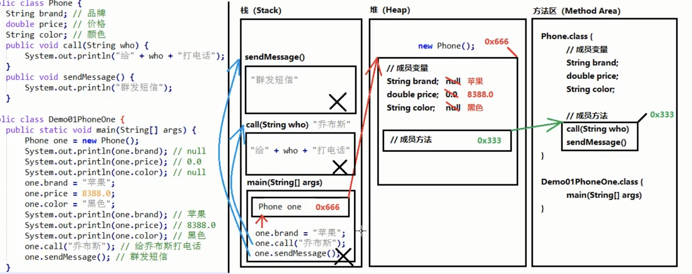
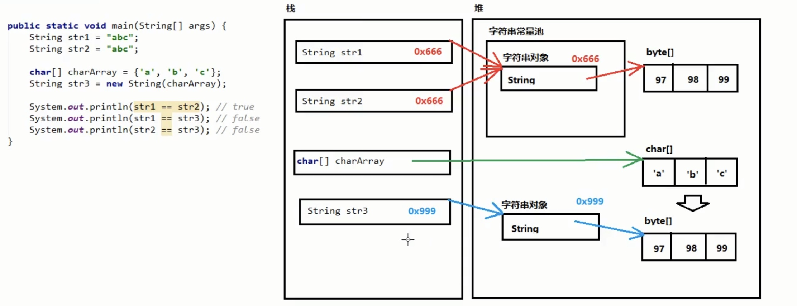
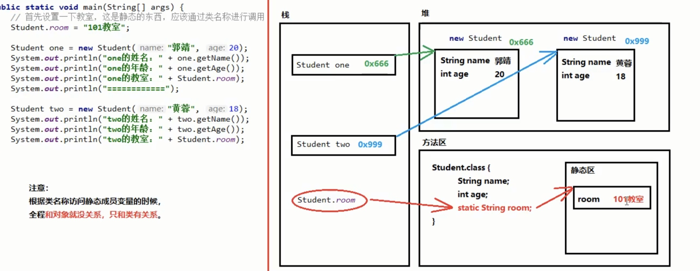
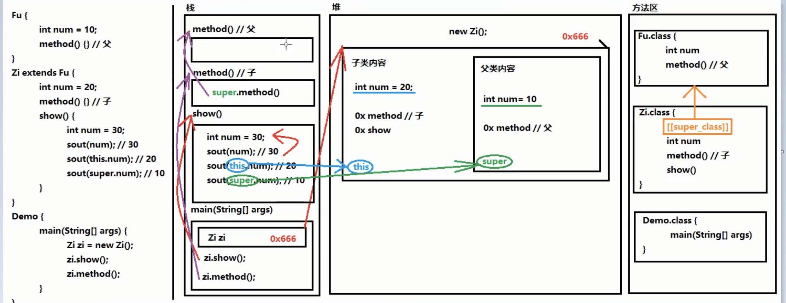

# Java

------

## 1  基础

------

### 1.1 前言

+ **JVM（Java Virtual Machine）：**`Java`虚拟机   简称`JVM`，是运行所有`Java`程序的假想计算机，是Java程序的运行环境，是Java 最具吸引力的特性之一，我们编写的`Java`代码，都运行在 `JVM `之上

+ **JRE (Java Runtime Environment) ：**是`Java`程序的运行时环境，包含 `JVM `和运行时所需要的 核心类库

+ **JDK (Java Development Kit)：**是`Java`程序开发工具包，包含`JRE` 和开发人员使用的工具

------

### 1.2 名称命名规范

+ **包名:** 多单词组成时所有字母都小写: **`xxxyyyzzz`**

+ **类名、接口名:** 多单词组成时，所有单词的首字母大写: **`XxxYyyZzz`**

+ **变量名、方法名:** 多单词组成时，第一个单词首字母小写，第二个单词开始每个 单词首字母大写: **`xxxYyyZzz`**

+ **常量名:** 所有字母都大写。多单词时每个单词用下划线连接: **`XXX_YYY_ZZZ`**

------

### 1.3 数据类型

|数据类型|关键字|内存占用|
|:----:|:----:|:----:|
|字节型|byte|1|
|短整型|short|2|
|整型|int|4|
|长整型|long|8|
|单精度浮点数|float|4|
|双精度浮点数|double|8|
|字符型|char|2|
|布尔型|boolean|1|


- **boolean** 类型数据只允许取值 **`true`** 和 **`false`**，无 **`null`**（不可以使用 `0` 或`非 0` 的整数替代 `false` 和 `true`，这点和C语言不同）

- **Java** 的浮点型常量默认为 **`double`** 型，声明**`float`** 型常量，须后加 ‘**f**’或 ‘**F**’

- 变量只能小的赋给大的，大给小会放不下（不同于C++）

将 **1.5** 赋值到 **`int`** 类型变量会发生编译失败，无法赋值

```java
int i = 1.5;   // 错误
i = i + 1.5;   // 错误
i += 1.5;      // 正确 相当于 i = (double)(i + 1);
```
**`+=`**有强转类型功能

------

### 1.4 方法

+ **方法：**就是将一个**功能**抽取出来，把代码单独定义在一个大括号内，形成一个单独的功能（类似于C++类中的函数）

```java
public class Java{
    public static void main(String[] args) {
    		//调用定义的方法method
    		method();
		}
		//定义方法，被main方法调用
		public static void method() {
				System.out.println("自己定义的方法，需要被main调用运行");
		}
}
```

------

### 1.5 IDEA快捷键

|          快捷键          |         功能         |
| :----------------------: | :------------------: |
|      `Alt + Enter`       | 导入包，自动修正代码 |
|        `Ctrl + Y`        |    删除光标所在行    |
|     `Ctrl + Alt + L`     |      格式化代码      |
| `Alt + Shift + 上下箭头` |    移动当前代码行    |

------

### 1.6 Java虚拟机的内存划分

| 五大区                           | 介绍                                                         |
| -------------------------------- | ------------------------------------------------------------ |
| 栈（Stack）                      | 存放方法中的局部变量（方法的参数、方法内部的变量、方法的运行），一旦超出作用域，立刻从栈中消失 |
| 堆（Heap）                       | new出的对象，都有地址值和默认值                              |
| 方法区（Method Area)             | 存储class相关信息                                            |
| 本地方法栈（Native Method Stack) | JVM在使用操作系统功能的时候使用，和我们开发无关              |
| 寄存器(Pc Register)              | 给CPU使用，和我们开发无关                                    |

## 2 数组

------

### 2.1 定义

+ 格式1：

  ```java
  数据类型[] 数组名字 = new 数据类型[长度];
  int[] arr = new int[3];
  ```

+ 格式2：

  ```java
  数据类型[] 数组名 = new 数据类型[]{元素1,元素2,元素3...};
  int[] arr = new int[]{1,2,3,4,5};
  ```

+ 格式3：

  ```java
  数据类型[] 数组名 = {元素1,元素2,元素3...};
  int[] arr = {1,2,3,4,5};
  ```

### 2.2 数组的访问

+ 数组默认值

```java
整型：默认 0
浮点型：默认 0.0
字符型：默认 ‘\u0000’
布尔型：默认 false
引用型：默认 null
```

+ `数组名.length`

```java
public static void main(String[] args) {
		int[] arr = new int[]{1,2,3,4,5};
		//打印数组的属性，输出结果是5
		System.out.println(arr.length);
}
```

### 2.3 数组最大值

```java
public static void main(String[] args) {
    int[] arr = {5, 15, 2000, 10000, 100, 4000};
    //定义变量，保存数组中0索引的元素
    int max = arr[0];
    //遍历数组，取出每个元素
    for (int i = 0; i < arr.length; i++) {
    	//遍历到的元素和变量max比较
    	//如果数组元素大于max
    	if (arr[i] > max) {
				//max记录住大值
				max = arr[i];
    	}
  	}
  System.out.println("数组最大值是： " + max);
}
```

### 2.4 数组反转

```java
public static void main(String[] args) {
		int[] arr = {1, 2, 3, 4, 5};
    for (int min = 0, max = arr.length - 1; min < max; min++, max--) {
       //利用第三方变量完成数组中的元素交换
			 int temp = arr[min];
       arr[min] = arr[max];
       arr[max] = temp;
     }
     // 反转后，遍历数组
     for (int i = 0; i < arr.length; i++) {
       System.out.println(arr[i]);
     }
}
```

### 2.5 数组作为方法返回值

+ 数组作为方法的返回值，返回的是数组的内存地址

```java
public static void main(String[] args) {
    int[] arr = getArray();
    for (int i = 0; i < arr.length; i++) {
       System.out.println(arr[i]);
    }
}
public static int[] getArray() {
    int[] arr = {1, 3, 5, 7, 9};
    return arr;
}
```

+ C++实现

```C++
//方法一
int *getArray(){
    int *arr = new int[5] {1, 3, 5, 7, 9};
    return arr;
}
//方法二
int *getArray()
{
    static int arr[] = {1,3,5,7,9};
    return arr;
}
int main(){
    int *arr1 = getArray();
    for(int i = 0; i < 5; i++){
        cout << arr1[i] << endl;
    }
    return 0;
}
```

## 3 类和对象

------

### 3.1 对象的调用

```java
public class Student {
    String name;
    int age;

    public void eat(){
        System.out.println("吃饭饭");
    }

    public void sleep(){
        System.out.println("睡觉觉");
    }

    public void study(){
        System.out.println("学习");
    }
}
--------------------------------------------------
/*
导包：
import 包名称.类名称;
如果属于同一个包，可省略不写

创建：
类名称 对象名 = new 类名称();
*/

public class DemoStudent {
    public static void main(String[] args) {
        Student stu = new Student();

        //使用成员变量
        stu.name = "帆仔";
        stu.age = 18;
        System.out.println(stu.name);
        System.out.println(stu.age);

        //使用成员方法
        stu.eat();
        stu.sleep();
        stu.study();
    }
}
```

有一个对象作为参数，传递到方法当中时，实际上传递进去的是对象的 **`地址值`**

------

### 3.2 局部变量 & 成员变量

|   变量   |  初始值  | 内存位置 |               生命周期               |
| :------: | :------: | :------: | :----------------------------------: |
| 成员变量 | 有默认值 |  堆内存  |   随着对象的创建而存在，消失而消失   |
| 局部变量 | 无默认值 |  栈内存  | 随着方法的调用而存在，方法调用完消失 |

+ 访问成员变量的两种方式
  + 直接通过对象名称访问成员变量：看等号左边是谁，优先用谁，没有则向上找
  + 间接通过成员方法访问成员变量：看该方法属于谁，优先用谁，没有则向上找
+ 访问成员方法
  + new的是谁，就优先用谁，没有则向上找

------

### 3.3 标准代码 -- Java Bean

`Java Bean` 是 `Java`语言编写类的一种标准规范。符合 `Java Bean` 的类，要求类必须是具体的和公共的，并且具有无参数的构造方法，提供用来操作成员变量的 `set` 和 `get` 方法

```java
public class ClassName{
//成员变量
//构造方法
//无参构造方法【必须】
//有参构造方法【建议】
//成员方法
//getXxx()
//setXxx()
//isXxx()  boolean获取用is
}
```

----

### 3.4 static 关键字

关于 static 关键字的使用，它可以用来修饰的成员变量和成员方法，被修饰的成员是属于类的，而不是单单是属于某个对象的。也就是说，既然属于类，就可以不靠创建对象来调用了。

+ 类变量

当 `static` 修饰成员变量时，该变量称为类变量。该类的每个对象都共享同一个类变量的值。任何对象都可以更改该类变量的值，但也可以在不创建该类的对象的情况下对类变量进行操作。

```java
//Student.java
public class Student {
    private String name;
    private int age;

    static String room;  //所在教室

    public Student() {
    }

    public Student(String name, int age) {
        this.name = name;
        this.age = age;
    }

    public String getName() {
        return name;
    }

    public void setName(String name) {
        this.name = name;
    }

    public int getAge() {
        return age;
    }

    public void setAge(int age) {
        this.age = age;
    }
}
//---------------------------------------------------------
//Demojava.java
public class DemoStatic {
    public static void main(String[] args) {
        Student s1 = new Student("帆仔", 20);
        s1.room = "101教室";
        Student s2 = new Student("呆呆", 18);

        System.out.println(s1.getName() + " " + s1.getAge() + " " + s1.room);   // 帆仔 20 101教室
        System.out.println(s2.getName() + " " + s2.getAge() + " " + s2.room);  // 呆呆 18 101教室
      	System.out.println(s2.getName() + " " + s2.getAge() + " " + Student.room);  // 呆呆 18 101教室（建议：类名.类变量名；）
    }
}

```

+ 静态方法

当 `static` 修饰成员方法时，该方法称为**静态方法** ，属于类，而不是对象。静态方法在声明中有 `static` ，建议使用类名来调用，而不需要创建类的对象。调用方式非常简单。

```java
// 访问类变量
类名.类变量名；

// 调用静态方法(建议)
类名.静态方法名(参数)；
// 对于本类中的静态方法，可以省略类名称
静态方法名(参数)； 
```

**注意：**静态不能访问非静态（在内存中先有静态内容，后有非静态内容--先人不知道后人，同时静态不能使用`this`指针）

```java
public class Static {
    int num;
    static int numStatic;
    
    public void method() {
        System.out.println(num);  //正确
        System.out.println(numStatic);  //正确
    }
    
    public static void methodStatic(String[] args) {
        System.out.println(num);  //错误--静态不能访问非静态
        System.out.println(numStatic);  //正确
    }
}
```

+ 静态代码块

```java
public class ClassName{
	static {
	// 执行语句
	}
}
```

​	作用：给类变量进行初始化赋值。用法演示，代码如下：

```java
public class Game {
	public static int number;
	public static ArrayList<String> list;
  
	static {
		// 给类变量赋值
		number = 2;
		list = new ArrayList<String>();
		// 添加元素到集合中
		list.add("张三");
		list.add("李四");
		}
}
```
>特点：当第一次用到本类时，静态代码块执行唯一一次。静态内容优先非静态，因此静态代码块比构造方法先执行（每次new都会执行构造，但静态代码块只运行一次）
>
>用途：用来一次性的对静态成员变量进行赋值
---

### 3.5 final 关键字

**final**： 不可改变，可以用于修饰类、方法和变量

+ **类：**被修饰的类，不能被继承

```java
//类：被修饰的类，不能被继承
public final class 类名 {
  
}
```

+ **方法：**被修饰的方法，不能被重写

```java
修饰符 final 返回值类型 方法名(参数列表) {
  //方法体
}
```

> 对于方法，`abstract`和`final`关键字不能同时使用，因为矛盾

+ **变量：**被修饰的变量，不能被重新赋值

1. 局部变量——基本类型

```java
public class FinalDemo1 {
	public static void main(String[] args) {
		// 声明变量，使用final修饰
		final int a;
		// 第一次赋值
		a = 10;
		// 第二次赋值
		a = 20; // 报错,不可重新赋值
    
		// 声明变量，直接赋值，使用final修饰
		final int b = 10;
		// 第二次赋值
		b = 20; // 报错,不可重新赋值
	}
}
```
2. 局部变量——引用类型

```java
public class FinalDemo2 {
	public static void main(String[] args) {
		// 创建 User 对象
		final User u = new User();
		// 创建 另一个 User对象
		u = new User(); // 报错，指向了新的对象，地址值改变。
		// 调用setName方法
		u.setName("张三"); // 可以修改
	}
}
```
> 引用类型的局部变量，被`final`修饰后，只能指向一个对象，地址不能再更改，但是不影响对象内部的成员变量值的修改

3. 成员变量

```java
//显示初始化；
public class User {
	final String USERNAME = "张三";
	private int age;
}

//构造方法初始化。
public class User {
	final String USERNAME ;
	private int age;
	public User(String username, int age) {
		this.USERNAME = username;
		this.age = age;
	}
}
```

> 由于成员变量具有默认值，因此用`final`修饰后，必须手动赋值
>
> 被`final`修饰的常量名称，一般都有书写规范，所有**字母都大写**

---

### 3.6 权限修饰符

四种修饰符：public  >  protected  >  （ default ） >  private

> `default`系统默认状态下的修饰符，不写
>
> 不加权限修饰符，其访问能力与`default`修饰符相同

|                          | public | protected | default | private |
| :----------------------: | :----: | :-------: | :-----: | :-----: |
|         同一类中         |   √    |     √     |    √    |    √    |
| 同一包中（子类与无关类） |   √    |     √     |    √    |         |
|       不同包的子类       |   √    |     √     |         |         |
|     不同包中的无关类     |   √    |           |         |         |

编写代码时，如果没有特殊的考虑，建议这样使用权限：

1. 成员变量使用 `private` ，隐藏细节。
2. 构造方法使用 `public` ，方便创建对象。
3. 成员方法使用 `public` ，方便调用方法。

>内部类的权限修饰符
>
>外部类：public /  ( default )
>成员内部类：public / protected /  ( default )  / private
>局部内部类：什么都不能写

---

### 3.7 内部类

将一个类**A**定义在另一个类**B**里面，里面的那个类**A**就称为**内部类**，**B**则称为**外部类**

+ 成员内部类

```java
修饰符 class 外部类 {
	修饰符 class 内部类 {
	}
}
```

> 内用外，随意访问；外用内，需要内部类对象

​	访问：

```java
间接访问：
  在外部类的方法中，使用内部类，然后main调用外部类的方法
直接访问：
  外部类名.内部类名 对象名 = new 外部类型().new 内部类型()；
```

```java
//Body.java
public class Body {  //外部类
  public class Heart {  //内部类
    //内部类方法
    public void beat () {
      System.out.println("心脏跳动：蹦蹦蹦！");
      Syetem.out.println("我叫：" + name);   //内用外
    }
  }
  
  //外部类的成员变量
  private String name;
  //外部类的方法（间接访问）
  public void methodBody() {
    System.out.println("外部类的方法！");
    new Heart().beat();
  }
  
  public String getName() {
    return name;
  }
  public void setName(String name) {
    this.name = name
  }
}

//DemoInnerClass.java
public class DemoInnerClass {
  public static void main(String[] args) {
    //间接访问
    Body body = new Body();  //外部类的对象
    body.methodBody();
    System.out.println("------------------------");
    
    //直接访问
    Body.Heart heart = new Body().new Heart();
    heart.beat();
  }
}

输出结果:
心脏跳动：蹦蹦蹦！
我叫：null
------------------------
心脏跳动：蹦蹦蹦！
我叫：null
```

+ 局部内部类

局部内部类：定义在一个方法内部的类（只有当前所属的方法可以使用，出了方法不可用）

```java
//Outer.java
public class Outer {
  public void mdthodOuter() {
    
    class Inner {  //局部内部类
      int num = 10;
      public void methodInner() {
        System.out.println(num);  // 10
      }
    }
    Inner inner = new Inner();
    inner.methodInner();
    
  }
}

//DemoMain.java
public class DemoMain {
  public static void main(String[] args) {
    Outer obj = new Outer();
    obj.methodOuter();
  }
}

运行结果：
10
```


> 
>如果访问所在方法的局部变量，那么这个局部变量必须是「`有效final的`」
> ```java
> //只要局部变量不改变，final关键字可以省略
> public class Outer {
>   	public void mdthodOuter() {
>     
>     		class Inner { 
>       		int num = 10;  //不可改变
>          //final int num = 10;
>       		public void methodInner() {
>        		System.out.println(num);  
>    			}
>    		}
>    	}
>     }
>   ```
> 
> new出来的对象在堆内存中，局部变量在栈内存中跟着方法走，方法运行结束后，立刻出栈，局部变量会立刻消失，但是new出来的对象会在堆内存中持续存在，直到回收

+ 匿名内部类

匿名内部类 ：是内部类的简化写法。它的本质是一个 `带具体实现的` `父类或者父接口的` `匿名的` 子类对象
前提：匿名内部类必须继承一个父类或者实现一个父接口

使用场景：接口的实现类（或者是父类的子类）只需使用唯一的一次

```java
父类名或接口名 对象名 = new 父类名或者接口名() {
	@Override  // 方法重写
	public void method() {
		// 执行语句
	}
};
```
> 在创建对象的时候，只能使用唯一一次
>
> 匿名内部类省略「实现类/子类名称」，匿名对象省略「对象名称」

+ 内部类的同名变量访问

```java
//外部类.this.外部类成员变量名
public class Outer {
  int num = 10;  //外部类成员变量
  
  public class Inner {
    int num = 20;  //内部类成员变量
    
    public void methodInner() {
      int num = 30;  /内部类局部变量
      System.out.println(num);  // 30
      System.out.println(this.num);  // 20
      System.out.println(Outer.this.num);  // 10
    }
  }
}
```


## 4 封装、继承、多态

---

### 4.1 封装

+ **this使用：**区分重名`（通过谁调用的方法，谁就是this）`

```java
public class Person {
    private String name;
    private boolean male;  //性别

    public void setMale(boolean male) {   //设置用set
        this.male = male;
    }

    public boolean isMale() {   //性别的获取用is，其他用get
        return male;
    }

    public void setName(String name) {
        this.name = name;
    }

    public String getName() {
        return name;
    }
}
```

+ **构造方法**（相当于C++构造函数：不写void、不可返回值）

```java
修饰符 构造方法名(参数列表) {
// 方法体
}
```

```java
public class Student {
    private String name;
    private int age;
    // 无参数构造方法（new对象调用 Person p = new Person();）
    public Student() {}
    // 有参数构造方法
    public Student(String name,int age) {
        this.name = name;
        this.age = age;
    }
}
```

**例子：**

```java
//person.java
public class Person {
    private String name;
    private int age;
    private boolean male;  //性别

    // 无参数构造方法
    public Person() {
        System.out.println("调用无参构造！");
    }
    // 有参数构造方法
    public Person(String name,int age,boolean male) {
        System.out.println("调用全参构造！");
        this.name = name;
        this.age = age;
        this.male = male;
    }

    //如果需要修改对象中成员变量的数据内容，仍需要set
    public void setMale(boolean male) {
        this.male = male;
    }

    public boolean isMale() {
        return male;
    }

    public void setName(String name) {
        this.name = name;
    }

    public String getName() {
        return name;
    }

    public void setAge(int age) {
        this.age = age;
    }

    public int getAge() {
        return age;
    }
}

```

```java
//DemoPerson.java
public class DemoPerson {
    public static void main(String[] args) {
        Person p = new Person();   //调用无餐构造
        Person p1 = new Person("呆呆",19,false);  //调用全参构造

        p.setName("帆仔");
        p.setAge(18);
        p.setMale(true);

        System.out.println("姓名: " + p.getName());
        System.out.println("年龄: " + p.getAge());
        System.out.println("是不是男孩纸: " + p.isMale());
    }
}
```

运行结果：

```java
调用无参构造！
调用全参构造！
姓名: 帆仔
年龄: 18
是不是男孩纸: true
Process finished with exit code 0
```

---

### 4.2 继承

+ 通过 `extends` 关键字，可以声明一个子类继承另外一个父类

```java
class 父类 {
	...
}
class 子类 extends 父类 {
	...
}
```

>**重名问题：**
>
>子父类中出现了同名的成员变量时，在子类中需要访问父类中非私有成员变量时，需要使用 `super` 关键字，修饰父类成员变量，类似于之前学过的 `this`

+ 通过`@Override`可以检测是否是重写

```java
public class Employee {
    public void method() {
        System.out.println("父类方法执行！");
    }
}
//----------------------------------------------
public class Teacher extends Employee {
    @Override   //建议写上，防止出错
    public void method() {
        System.out.println("子类方法执行");
    }
}
```

>**方法重写问题：**
>
>子类方法的返回值必须**小于等于**父类方法的返回值范围
>
>子类方法的权限必须**大于等于**父类方法的权限修饰符（
>
>父：private 子：public   正确
>
>父：public  子：private  错误

+ 构造方法

  + 构造方法的名字是与类名一致的，所以子类是无法继承父类构造方法的
  + 构造方法的作用是初始化成员变量的。所以子类的初始化过程中，必须先执行父类的初始化动作。子类的构造方法中默认有一个 `super()` ，表示调用父类的构造方法，父类成员变量初始化后，才可以给子类使用

```java
class Fu {
	private int n;
	public Fu(){
		System.out.println("Fu()");
	}
}

class Zi extends Fu {
	public Zi(){
		//super();   默认调用父类构造
    //super（20）  子类可以通过super调用父类重载构造
		System.out.println("Zi()");
	}
}

public class DemoExtends{
	public static void main (String args[]){
	Zi zi = new Zi();
	}
}

输出结果：
Fu（）
Zi（）
```

>**super 关键字用法：**
>
>1. 在子类的成员方法中，访问父类的成员变量
>2. 在子类的成员方法中，访问父类的成员方法
>3. 在子类的构造方法中，访问父类的构造方法

> `this`: 代表当前对象的引用，访问本类的内容（谁调用代表谁）
> `super`: 代表父类的存储空间标识，访问父类的内容（父亲的引用）
>
> ```java
> this.成员变量   // 本类的
> super.成员变量   // 父类的
>   
> this.成员方法名()  // 本类的
> super.成员方法名()  // 父类的
> ```

+ **抽象类**

父类中的方法，被它的子类们重写，子类各自的实现都不尽相同。那么父类的方法声明和方法主体，只有声明还有意义，而方法主体则没有存在的意义了。我们把没有方法主体的方法称为抽象方法。Java语法规定，包含抽象方法的类就是抽象类。

使用 `abstract` 关键字修饰方法，该方法就成了抽象方法，抽象方法只包含一个方法名，而没有方法体，如果一个类包含抽象方法，那么该类必须是抽象类

```java
修饰符 abstract class 类名字 {
  修饰符 abstract 返回值类型 方法名 (参数列表)；
}
  
public abstract class 类名字 {
  public abstract void run()；
}
```

> 不能直接new抽象类对象
>
> > 理解：假设创建了抽象类的对象，调用抽象的方法，而抽象方法没有具体的方法体，没有意义

> 抽象类的子类，必须重写抽象父类中所有的抽象方法，否则，编译无法通过而报错。除非该子类也是抽象类

　📎 [内存分析](#继承内存分析)

---

### 4.3 接口

接口的定义，它与定义类方式相似，但是使用 `interface` 关键字。它也会被编译成`.class`文件，但一定要明确它并不是类，而是另外一种引用数据类型。

接口的使用，它不能创建对象，但是可以被实现（ `implements` ，类似于被继承）。一个实现接口的类（可以看做是接口的子类），需要实现接口中所有的抽象方法，创建该类对象，就可以调用方法了，否则它必须是一个抽象类。

> Java 7
> 1. 常量
> 2. 抽象方法
>
> Java 8
> 3. 默认方法
> 4. 静态方法
>
> Java 9 
>
> 5. 私有方法

```java
public interface 接口名称 {
// 抽象方法
// 默认方法
// 静态方法
// 私有方法
}
//--------------------------------------------------------------------------
//接口当中的抽象方法，修饰符必须是固定的关键字：public abstract （可选择性省略）
public interface MyInterfaceAbstract {

    //抽象方法
		//[public] [abstract] 返回值类型 方法名称（参数列表); 
    public abstract void methods1();
    abstract void methods2();
    public void methods3();
    void methods4();
  
  	//默认方法
		//[public] [default] 返回值类型 方法名称（参数列表）{方法体}
  	public default void fly(){
			System.out.println("天上飞");
      
    //静态方法
		//[public] static 返回值类型 方法名称（参数列表）{方法体}
		}
}
```

> 默认方法：接口类中增加默认方法（接口升级），实现类中无需重写便可调用（抽象方法需重写），也可以重写覆盖
>
> **注意：**不能通过接口实现类的对象来调用接口当中的**静态方法**
>
> ```java
> 正确用法：通过接口名称直接调用静态方法
> 接口名称.静态方法名(参数);
> ```

+ 私有方法

如果一个接口中有多个默认方法，并且方法中有重复的内容，那么可以抽取出来，封装到私有方法中，供默认方法
去调用

**私有方法：**解决多个默认方法之间重复代码问题（只有默认方法可以调用）
**私有静态方法：**解决多个静态方法之间重复代码问题（默认方法和静态方法可以调用）

```java
//私有方法：
//private 返回值类型 方法名（参数列表）{方法体}

//静态私有方法：
//private static 返回值类型 方法名（参数列表）{方法体}

public interface MyInterfacePrivate {
  public default void mdthodDefault1() {
    System.out.println("默认方法1");
    methodCommon();
  }
  
  public default void mdthodDefault2() {
    System.out.println("默认方法2");
    methodCommon();
  }
  
  private void mdthodDefault1() {
    System.out.println("AAA");
    System.out.println("BBB");
    System.out.println("CCC");
  }
}
```

+ 接口使用：

```java
public class 实现类名 implements 接口名 {
	// 重写接口中抽象方法【必须】
	// 重写接口中默认方法【可选】
}

//------------------------------------------------------------------
public class DemoInterface {
    public static void main(String[] args) {
        //MyInterfaceAbstract inter = new MyInterfaceAbstract();  错误，不能直接new接口
        //创建实现类
        MyInterfaceAbstractImpl inter = new MyInterfaceAbstractImpl();
        inter.methods();
    }
}
//------------------------------------------------------------------
public interface MyInterfaceAbstract {
    //抽象方法
    public abstract void methods();
}
//------------------------------------------------------------------
public class MyInterfaceAbstractImpl implements MyInterfaceAbstract {
    @Override
    public void methods() {
        System.out.println("方法");
    }
}

```

+ 接口的常量

接口中可以定义“成员变量”，但必须使用public static final关键字进行修饰（可以省略关键字）

```java
//格式：[public] [static] [final] 数据类型 常量名 = 数据值;

public interface MyInterfaceConst {
    //这其实就是一个常量，一旦赋值，不可修改
    public static final int NUM = 10;  //final不可变
    //可以省略关键字
}
```

> 接口中的常量必须进行赋值（要是默认值设置，不能修改，那毫无意义）
>
> 接口中的常量需要大写，用下划线分隔

> **接口备注：**
>
> 接口没有静态代码块和构造方法

+ 接口的多实现

一个类的直接父类是唯一的，但是一个类可以同时实现多个接口

```java
public class 类名 [extends 父类名] implements 接口名1,接口名2,接口名3... {
// 重写接口中抽象方法【必须】
// 重写接口中默认方法【不重名时可选】
}
```

> 抽象方法：
>
> > 接口中，有多个抽象方法时，实现类必须重写所有抽象方法（如果抽象方法有重名的，只需要重写一次）
> >
> > 如果实现类没有覆盖重写所有接口当中的抽象方法，那么实现类必须写成抽象类`public abstract` class`

> 默认方法：
>
> > 接口中，有多个默认方法时，实现类都可继承使用（如果默认方法有重名的，必须重写一次）
> >
> > 如果父类中的方法和接口中的默认方法产生了冲突，优先使用父类中的方法

> 静态方法：
>
> > 接口中，存在同名的静态方法并不会冲突，原因是只能通过各自接口名访问静态方法

+ 接口的多继承

一个接口能继承另一个或者多个接口，这和类之间的继承比较相似。接口的继承使用 `extends` 关键字，子接口继承父接口的方法。如果父接口中的默认方法有重名的，那么子接口需要重写一次（抽象方法重复，没关系，因为没有方法体，没有具体的实现）

```java
//定义父类接口
public interface A {
	public default void method(){
	System.out.println("AAAAAAAAAAAAAAAAAAA");
	}
}

public interface B {
	public default void method(){
	System.out.println("BBBBBBBBBBBBBBBBBBB");
	}
}

//定义子类接口
public interface D extends A,B{
	@Override
	public default void method() {
	System.out.println("DDDDDDDDDDDDDD");
	}
}
```

>⚠️
> **子接口**重写默认方法时，default关键字需要保留。
> **子类**重写默认方法时，default关键字不可以保留。

### 4.4 多态

多态： 是指同一行为，具有多个不同表现形式。

```java
父类类型 变量名 = new 子类对象；
变量名.方法名();
```

> 当使用多态方式调用方法时，首先检查父类中是否有该方法，如果没有，则编译错误；如果有，执行的是子类重写后方法

```java
public class DemoMain {
    public static void main(String[] args) {
        Cat c = new Cat();
        showAnimalEat(c);
    }

    public static void showAnimalEat(Animal a) {
        a.eat();
    }
}
```

+ *对象的向上向下转型**

```java
//Animal.java
public abstract class Animal {
    public abstract void eat();
}

//Cat.java
public class Cat extends Animal {
    @Override
    public void eat() {
        System.out.println("猫吃鱼！");
    }

    //子类特有方法
    public void catchMouse() {
        System.out.println("猫抓老鼠！");
    }
}

//DemoMain.java
public class DemoMain {
    public static void main(String[] args) {

        //对象的向上转型--父类引用指向子类对象
        Animal animal = new Cat();
        animal.eat();
        //animal.catchMouse();  错误：对象向上转型为父类，无法调用子类特有的方法

        //对象的向下转型--还原动作
        Cat cat = (Cat) animal;
        cat.catchMouse();
    }
}
```

+ **Interfaceof 关键字**

```java
//DemoInterfaceof.java
public class DemoInstanceof {
    public static void main(String[] args) {

        //对象的向上转型--父类引用指向子类对象
        Animal animal = new Cat();
        animal.eat();

        //对象名 instanceof 类名
        //返回boolean结果，判断前面的对象能不能当作后面类型的实例（判断animal是不是Cat）
        if (animal instanceof Cat) {
            Cat cat = (Cat) animal;
            cat.catchMouse();
        }
    }
}
```


## 5 常用类

------

### 5.1 Scanner 类

使用Scanner类，完成接收键盘录入数据的操作，代码如下：

```java
import java.util.Scanner;    //导包（只有java.lang包下的内容不需要导包）

public class DemoScanner {
    public static void main(String[] args) {

        //System.in代表从键盘进行输入
        Scanner sc = new Scanner(System.in);

        //获取键盘输入的一个int数字
        int num = sc.nextInt();
        System.out.println("输入的Int数字是：" + num);

        //获取键盘输入的一个字符串
        String str = sc.next();
        System.out.println("输入的字符串是：" + str);
    }
}
```

---

### 5.2 Random 类

此类的实例用于生成伪随机数

```java
import java.util.Random;

public class DemoRandom {
    public static void main(String[] args) {
        Random r = new Random();   //获取一个随机数

        int num = r.nextInt();
        System.out.println(num);

        int num1 = r.nextInt(10);  //获取一个 [0,10) 的随机数
        System.out.println(num1);
    }
}
```

---

### 5.3 ArrayList 类

ArrayList 是大小可变的数组的实现（数组必须定义大小，一旦定义不可变化）

> `public boolean add(E e)` ：将指定的元素添加到此集合的尾部。
> `public E remove(int index)` ：移除此集合中指定位置上的元素，返回被删除的元素。
> `public E get(int index)` ：返回此集合中指定位置上的元素，返回获取的元素。
> `public int size()` ：返回此集合中的元素数。遍历集合时，可以控制索引范围，防止越界。

```java
import java.util.ArrayList;

public class DemoArrayList {
    public static void main(String[] args) {
        ArrayList<String> list = new ArrayList<>();
        System.out.println(list);  //如果list内容为空，直接打印得到的不是地址值，而是[]

        //添加元素
        list.add("呆呆");
        list.add("帆仔");
        System.out.println(list);

        //public E get(int index):返回指定索引处的元素
        System.out.println("get: "+list.get(0));
        System.out.println("get: "+list.get(1));

        //public int size():返回集合中的元素的个数
        System.out.println("size: "+list.size());

        //public E remove(int index):删除指定索引处的元素，返回被删除的元素
        System.out.println("remove: "+list.remove(0));

        //遍历输出
        for(int i = 0; i < list.size(); i++){
            System.out.println(list.get(i));
        }
    }
}
```

运行结果：

```java
[]
[呆呆, 帆仔]
get: 呆呆
get: 帆仔
size: 2
remove: 呆呆
帆仔
Process finished with exit code 0
```

+ 其他数据类型的ArrayList

ArrayList对象不能存储基本类型，只能存储引用类型的数据。类似 `<int>` 不能写，但是存储基本数据类型对应的包装类型是可以的。所以，想要存储基本类型数据， `<>` 中的数据类型，必须转换后才能编写，转换写法如下：

| 基本类型 | 包装类型  |
| :------: | :-------: |
|   byte   |   Byte    |
|  short   |   Short   |
|   int    |  Integer  |
|   long   |   Long    |
|  double  |  Double   |
|   char   | Character |
| boolean  |  Boolean  |

---

### 5.4 String 类

+ 字符串的内容永不可改变，因此可以共享使用


+ **构造方法：**
> `public String()` ：初始化新创建的 String对象，以使其表示空字符序列
> `public String(char[] value)` ：通过当前参数中的字符数组来构造新的String
> `public String(byte[] bytes)` ：通过使用平台的默认字符集解码当前参数中的字节数组来构造新的String

```java
public class DemoString {
    public static void main(String[] args) {
        String str1 = new String();
        System.out.println("第一种：" + str1);  //第一种：

        char[] charArray = {'A', 'B' ,'C'};
        String str2 = new String(charArray);
        System.out.println("第二种：" + str2);  //第二种：ABC

        byte[] byteArray = {97, 98, 99};
        String str3 = new String(byteArray);
        System.out.println("第三种：" + str3);  //第三种：abc

        //直接创建
        String str4 = "Hello!";
        System.out.println("直接创建：" + str4);  //直接创建：Hello!
    }
}
```

+ **常量池：**

  对于基本类型来说，== 是进行数值的比较

  对于引用类型来说，== 是进行**地址值**的比较

```java
public class DemoString {
  public static void main(String[] args) {
    String str1 = "abc";
    String str2 = "abc";
    
    char[] charArray = {'a', 'b', 'c'};
    String str3 = new String(charArray);
    
    System.out.println(str1 == str2);   //true
    System.out.println(str1 == str3);   //false
    System.out.println(str2 == str3);   //false
  }
}
```

双引号直接写的字符串在常量池中，new的不在池中

+ **判断功能的方法：**

> `public boolean equals (Object anObject)` ：将此字符串与指定对象进行比较
> `public boolean equalsIgnoreCase (String anotherString)` ：将此字符串与指定对象进行比较，忽略大小写

​       如果比较一个常量和一个变量，推荐把常量字符串写在前面

```java
public class DemoString {
	public static void main(String[] args) {
		// 创建字符串对象
		String s1 = "hello";
		String s2 = "hello";
		String s3 = "HELLO";
    
		// boolean equals(Object obj): 比较字符串的内容是否相同
		System.out.println(s1.equals(s2));   // true
		System.out.println(s1.equals(s3));   // false
		System.out.println("‐‐‐‐‐‐‐‐‐‐‐");

    //boolean equalsIgnoreCase(String str): 比较字符串的内容是否相同,忽略大小写
		System.out.println(s1.equalsIgnoreCase(s2));   // true
		System.out.println(s1.equalsIgnoreCase(s3));   // true
		System.out.println("‐‐‐‐‐‐‐‐‐‐‐");
	}
}
```

+ **获取功能的方法：**
> `public int length ()` ：返回此字符串的长度
> `public String concat (String str)` ：将当前的字符串连接到该字符串的末尾
> `public char charAt (int index)` ：返回指定索引处的 char值
> `public int indexOf (String str)` ：返回指定子字符串第一次出现在该字符串内的索引，没有返回-1
> `public String substring (int beginIndex)` ：返回一个子字符串，从beginIndex开始截取字符串到字符
    串结尾
> `public String substring (int beginIndex, int endIndex)` ：返回一个子字符串，从`beginIndex`到`endIndex`截取字符串。含`beginIndex`，不含`endIndex`

```java
public class DemoString {
	public static void main(String[] args) {
		//创建字符串对象
		String s = "helloworld";
    
		// int length():获取字符串的长度，其实也就是字符个数
		System.out.println(s.length());  //10

		// String concat (String str):将将指定的字符串连接到该字符串的末尾.
		String s2 = s.concat("**hello itheima");
		System.out.println(s2);  // helloworld**hello itheima
    
		// char charAt(int index):获取指定索引处的字符
		System.out.println(s.charAt(0));  //h
		System.out.println(s.charAt(1));  //e

		// int indexOf(String str):获取str在字符串对象中第一次出现的索引,没有返回‐1
		System.out.println(s.indexOf("l"));  //2

		// String substring(int start):从start开始截取字符串到字符串结尾
		System.out.println(s.substring(2));  /lloworld

		// String substring(int start,int end):从start到end截取字符串。含start，不含end。
		System.out.println(s.substring(0, s.length()));  //helloworld
		System.out.println(s.substring(3,8));  //lowor
	}
}
```

+ **转换功能的方法：**
> `public char[] toCharArray ()` ：将当前字符串拆分为字符数组作为返回值
> `public byte[] getBytes ()` ：使用平台的默认字符集将该 String编码转换为新的字节数组
> `public String replace (CharSequence target, CharSequence replacement)` ：将与`target`匹配的字符串使用`replacement`字符串替换（`CharSequence`：可以接受字符串类型）

```java
public class DemoString {
	public static void main(String[] args) {
		//创建字符串对象
		String s = "abcde";
		
    // char[] toCharArray():把字符串转换为字符数组
		char[] chs = s.toCharArray();
		for(int i = 0; i < chs.length; i++) {
			System.out.println(chs[i]);  //a b c d e
		}
		
		// byte[] getBytes ():把字符串转换为字节数组
		byte[] bytes = s.getBytes();
		for(int i = 0; i < bytes.length; i++) {
			System.out.println(bytes[i]);  //97 98 99 100 101
		}

		// 替换字母it为大写IT
    String str = "itcast itheima";
		String replace = str.replace("it", "IT");
		System.out.println(replace);  // ITcast ITheima
  }
}
```

+ **分割功能的方法：**
> `public String[] split(String regex)` ：将此字符串按照给定的`regex`（规则）拆分为字符串数组

```java
public class DemoString {
	public static void main(String[] args) {
		//创建字符串对象
		String s = "aa|bb|cc";
		String[] strArray = s.split("|");  // ["aa", "bb", "cc"]
		for(int x = 0; x < strArray.length; x++) {
			System.out.println(strArray[x]);  // aa bb cc
		}
	}
}
```
不能用`.`分割，因为不是正则表达式，可以用 `\\.`

---

### 5.5 Arrays 类

`java.util.Arrays` 此类包含用来操作数组的各种方法，比如排序和搜索等。其所有方法均为静态方法，调用起来非常简单。

> `public static String toString(int[] a)` ：返回指定数组内容的字符串表示形式（按照默认格式：[][][元素1，元素2...] )

```java
import java.util.Arrays;
public static void main(String[] args) {
	// 定义int 数组
	int[] arr = {2,34,35,4,657,8,69,9};
  
	// 打印数组,输出地址值
	System.out.println(arr); // [I@2ac1fdc4
  
	// 数组内容转为字符串
		String s = Arrays.toString(arr);
  
	// 打印字符串,输出内容
	System.out.println(s); // [2, 34, 35, 4, 657, 8, 69, 9]
}
```

> `public static void sort(int[] a)` ：对指定的 int 型数组按数字升序进行排序

```java
public static void main(String[] args) {
	// 定义int 数组
	int[] arr = {24, 7, 5, 48, 4, 46, 35, 11, 6, 2};
	System.out.println("排序前:"+ Arrays.toString(arr)); 
  // 排序前:[24, 7, 5, 48, 4, 46, 35, 11, 6, 2]
  
	// 升序排序
	Arrays.sort(arr);
	System.out.println("排序后:"+ Arrays.toString(arr));
  // 排序后:[2, 4, 5, 6, 7, 11, 24, 35, 46, 48]
}
```

---

### 5.6 Math 类

`java.lang.Math` 类包含用于执行基本数学运算的方法，如初等指数、对数、平方根和三角函数。类似这样的工具类，其所有方法均为静态方法，并且不会创建对象，调用起来非常简单

> `public static double abs(double a)` ：返回 double 值的绝对值
>  `public static double ceil(double a)` ：返回大于等于参数的最小的整数
> `public static double floor(double a)` ：返回小于等于参数最大的整数
> `public static long round(double a)` ：返回最接近参数的 long (相当于四舍五入方法)

```java
double d1 = Math.abs(‐5);  //d1的值为5
double d2 = Math.abs(5);  //d2的值为5

double d1 = Math.ceil(3.3);  //d1的值为 4.0
double d2 = Math.ceil(‐3.3);  //d2的值为 ‐3.0
double d3 = Math.ceil(5.1);  //d3的值为 6.0

double d1 = Math.floor(3.3);  //d1的值为3.0
double d2 = Math.floor(‐3.3);  //d2的值为‐4.0
double d3 = Math.floor(5.1);  //d3的值为 5.0

long d1 = Math.round(5.5);  //d1的值为6.0
long d2 = Math.round(5.4);  //d2的值为5.0
```

---

### 5.7 Object 类

`java.lang.Object` 类是Java语言中的根类，即所有类的父类。它中描述的所有方法子类都可以使用。在对象实例化的时候，最终找的父类就是`Object`。

如果一个类没有特别指定父类， 那么默认则继承自`Object`类。

```java
public class MyClass /*extends Object*/ {
		// ...
}
```

> `public String toString()` ：返回该对象的字符串表示。
> `public boolean equals(Object obj)` ：指示其他某个对象是否与此对象“相等”

+ **toString 方法**

> `public String toString()` ：返回该对象的字符串表示。

`toString`方法返回该对象的字符串表示，其实该字符串内容就是`对象的类型+@+内存地址值`。
由于`toString`方法返回的结果是内存地址，而在开发中，经常需要按照对象的属性得到相应的字符串表现形式，因此也需要重写它。

**覆盖重写**

```java
public class Person {
		private String name;
		private int age;
  
		@Override
		public String toString() {
				return "Person{" + "name='" + name + '\'' + ", age=" + age +'}';
		}
		// 省略构造器与Getter Setter
}
```

> 如果重写，`println`输出的对象将不是地址值，而是内容

+ **equals 方法**

> `public boolean equals(Object obj)` ：指示其他某个对象是否与此对象“相等”

**默认地址比较**

如果没有覆盖重写`equals`方法，那么`Object`类中默认进行 `==` 运算符的对象地址比较，只要不是同一个对象，结果必然为`false`。

**对象内容比较**

如果希望进行对象的内容比较，即所有或指定的部分成员变量相同就判定两个对象相同，则可以覆盖重写`equals`方法。

```java
import java.util.Objects;

public class Person {
		private String name;
		private int age;
  
		@Override
		public boolean equals(Object o) {
				// 如果对象地址一样，则认为相同
				if (this == o)
						return true;
				// 如果参数为空，或者类型信息不一样，则认为不同
      	//getClass() 使用反射技术，判断是否Person类，等效于o instance of Person
				if (o == null || getClass() != o.getClass())
						return false;
				// 转换为当前类型（否则父类无法访问子类特有的内容）
				Person person = (Person) o;
				// 要求基本类型相等，并且将引用类型交给java.util.Objects类的equals静态方法取用结果
				return age == person.age && Objects.equals(name,person.name);
		}
}
```

在比较两个对象的时候，`Object`的`equals`方法容易抛出**空指针异常**，而`Objects`类中的`equals`方法就优化了这个问题。

> `public static boolean equals(Object a, Object b)` : 判断两个对象是否相等

```java
public static boolean equals(Object a, Object b) {
		return (a == b) || (a != null && a.equals(b));
}
```

---

### 5.8 日期时间类

#### Date 类

> `public Date()` ：分配`Date`对象并初始化此对象，以表示分配它的时间（精确到毫秒）
>
> `public Date(long date)` ：分配Date对象并初始化此对象，以表示自从标准基准时间（称为“历元（epoch）”，即1970年1月1日00:00:00 GMT）以来的指定毫秒数
>
> `public long getTime()`:   把日期对象转换成对应的时间毫秒值

简单来说：使用无参构造，可以自动设置当前系统时间的毫秒时刻；指定long类型的构造参数，可以自定义毫秒时刻。例如：

```java
import java.util.Date;

public class Demo01Date {
		public static void main(String[] args) {
				// 创建日期对象，把当前的时间
				System.out.println(new Date()); 
				// 创建日期对象，把当前的毫秒值转成日期对象
				System.out.println(new Date(0L)); 
     	  //把日期对象转换成对应的时间毫秒值
      	System.out.println(new Date().getTime());
		}
}

运行结果：
Tue Feb 09 10:51:17 CST 2021
Thu Jan 01 08:00:00 CST 1970
1612839838125
```

> tips:在使用println方法时，会自动调用Date类中的toString方法。Date类对Object类中的toString方法进行了覆盖重写，所以结果为指定格式的字符串。
>
> 时间原点：Thu Jan 01 08:00:00 CST 1970

---

#### DateFormat 类

`java.text.DateFormat` 是日期/时间格式化子类的抽象类，我们通过这个类可以帮我们完成日期和文本之间的转换,也就是可以在`Date`对象与`String`对象之间进行来回转换。

+ 格式化：按照指定的格式，从`Date`日期转换为`String`字符串。
+ 解析：按照指定的格式，从`String`字符串转换为`Date`日期。

**构造方法**

由于`DateFormat`为抽象类，不能直接使用，所以需要常用的子类`java.text.SimpleDateFormat` 。这个类需要一个模式（格式）来指定格式化或解析的标准。构造方法为：

> `public SimpleDateFormat(String pattern)` ：用给定的模式和默认语言环境的日期格式符号构造`SimpleDateFormat`

```java
import java.text.DateFormat;
import java.text.SimpleDateFormat;

public class Demo02SimpleDateFormat {
		public static void main(String[] args) {
				// 对应的日期格式如：2018‐01‐16 15:06:38
				DateFormat format = new SimpleDateFormat("yyyy‐MM‐dd HH:mm:ss");
		}
}
```

> `public String format(Date date)` ：将Date对象格式化为字符串
>
> `public Date parse(String source)` ：将字符串解析为Date对象

**format 方法**

```java
import java.text.DateFormat;
import java.text.SimpleDateFormat;
import java.util.Date;
/*
把Date对象转换成String
*/
public class Demo03DateFormatMethod {
		public static void main(String[] args) {
				Date date = new Date();
				// 创建日期格式化对象,在获取格式化对象时可以指定风格
				DateFormat df = new SimpleDateFormat("yyyy年MM月dd日");
				String str = df.format(date);
				System.out.println(str); 
		}
}

运行结果：
2021年02月09日
```

**parse 方法**

```java
import java.text.DateFormat;
import java.text.ParseException;
import java.text.SimpleDateFormat;
import java.util.Date;
/*
把String转换成Date对象
*/
public class Demo04DateFormatMethod {
		public static void main(String[] args) throws ParseException {
				DateFormat df = new SimpleDateFormat("yyyy年MM月dd日");
				String str = "2018年12月11日";
				Date date = df.parse(str);
				System.out.println(date); 
		}
}

运行结果：
Tue Dec 11 00:00:00 CST 2018
```

---

#### Calendar 类

`java.util.Calendar` 是日历类，在`Date`后出现，替换掉了许多`Date`的方法。该类将所有可能用到的时间信息封装为静态成员变量，方便获取。日历类就是方便获取各个时间属性的

**获取方式**

Calendar为抽象类，由于语言敏感性，Calendar类在创建对象时并非直接创建，而是通过静态方法创建，返回子类对象，如下：

> `public static Calendar getInstance()` ：使用默认时区和语言环境获得一个日历

```java
import java.util.Calendar;
public class Demo06CalendarInit {
		public static void main(String[] args) {
				Calendar cal = Calendar.getInstance();
		}
}
```

**常用方法**

> `public int get(int field)` ：返回给定日历字段的值。
> `public void set(int field, int value)` ：将给定的日历字段设置为给定值。
> `public abstract void add(int field, int amount)` ：根据日历的规则，为给定的日历字段添加或减去指定的时间量。
> `public Date getTime()` ：返回一个表示此`Calendar`时间值（从历元到现在的毫秒偏移量）的`Date`对象。

| 字段值       | 含义                                  |
| ------------ | ------------------------------------- |
| YEAR         | 年                                    |
| MONTH        | 月（从0开始，可以+1使用）             |
| DAY_OF_MONTH | 月中的天（几号）                      |
| HOUR         | 时（12小时制）                        |
| HOUR_OF_DAY  | 时（24小时制）                        |
| MINUTE       | 分                                    |
| SECOND       | 秒                                    |
| DAY_OF_WEEK  | 周中的天（周几，周日为1，可以-1使用） |

**get  /set 方法**

get方法用来获取指定字段的值，set方法用来设置指定字段的值，代码使用演示：

```java
import java.util.Calendar;

public class CalendarUtil {
    public static void main(String[] args) {
        // 创建Calendar对象
        Calendar cal = Calendar.getInstance();
        // 设置年 
        int year = cal.get(Calendar.YEAR);
        // 设置月
        int month = cal.get(Calendar.MONTH) + 1;
        // 设置日
        int dayOfMonth = cal.get(Calendar.DAY_OF_MONTH);
        System.out.print(year + "年" + month + "月" + dayOfMonth + "日");
    }    
}

运行结果：
2021年2月9日
```

```java
import java.util.Calendar;

public class Demo07CalendarMethod {
    public static void main(String[] args) {
        Calendar cal = Calendar.getInstance();
        cal.set(Calendar.YEAR, 2020);      
     		// 设置年 
        int year = cal.get(Calendar.YEAR);
        // 设置月
        int month = cal.get(Calendar.MONTH) + 1;
        // 设置日
        int dayOfMonth = cal.get(Calendar.DAY_OF_MONTH);
        System.out.print(year + "年" + month + "月" + dayOfMonth + "日"); // 2020年1月17日
    }
}

运行结果：
2020年2月9日
```

**add 方法**

add方法可以对指定日历字段的值进行加减操作，如果第二个参数为正数则加上偏移量，如果为负数则减去偏移量。代码如：

```java
import java.util.Calendar;

public class Demo08CalendarMethod {
    public static void main(String[] args) {
        Calendar cal = Calendar.getInstance();
        System.out.print(year + "年" + month + "月" + dayOfMonth + "日"); // 2018年1月17日
        // 使用add方法
        cal.add(Calendar.DAY_OF_MONTH, 2); // 加2天
        cal.add(Calendar.YEAR, -3); // 减3年
        System.out.print(year + "年" + month + "月" + dayOfMonth + "日"); // 2015年1月18日; 
    }
}
```

**getTime 方法**

Calendar中的getTime方法并不是获取毫秒时刻，而是拿到对应的Date对象。

```java
import java.util.Calendar;
import java.util.Date;

public class Demo09CalendarMethod {
    public static void main(String[] args) {
        Calendar cal = Calendar.getInstance();
        Date date = cal.getTime();
        System.out.println(date); // Tue Jan 16 16:03:09 CST 2018
    }
}
```

> 小贴士：
>
>   西方星期的开始为周日，中国为周一。
>
>   在Calendar类中，月份的表示是以0-11代表1-12月。
>
>   日期是有大小关系的，时间靠后，时间越大。
>

---

### 5.9 System 类

`java.lang.System`类中提供了大量的静态方法，可以获取与系统相关的信息或系统级操作，在System类的API文档中，常用的方法有：

> `public static long currentTimeMillis()`：返回以毫秒为单位的当前时间。
> `public static void arraycopy(Object src, int srcPos, Object dest, int destPos, int length)`：将数组中指定的数据拷贝到另一个数组中。

**currentTimeMillis 方法**

实际上，currentTimeMillis方法就是 获取当前系统时间与1970年01月01日00:00点之间的毫秒差值

```java
import java.util.Date;

public class SystemDemo {
    public static void main(String[] args) {
       	//获取当前时间毫秒值
        System.out.println(System.currentTimeMillis()); // 1516090531144
    }
}
```

验证for循环打印数字1-9999所需要使用的时间（毫秒）

~~~java
public class SystemTest1 {
    public static void main(String[] args) {
        long start = System.currentTimeMillis();
        for (int i = 0; i < 10000; i++) {
            System.out.println(i);
        }
        long end = System.currentTimeMillis();
        System.out.println("共耗时毫秒：" + (end - start));
    }
}
~~~

**arraycopy 方法**

> `public static void arraycopy(Object src, int srcPos, Object dest, int destPos, int length)`：将数组中指定的数据拷贝到另一个数组中。

数组的拷贝动作是系统级的，性能很高。System.arraycopy方法具有5个参数，含义分别为：

| 参数序号 | 参数名称 | 参数类型 | 参数含义             |
| -------- | -------- | -------- | -------------------- |
| 1        | src      | Object   | 源数组               |
| 2        | srcPos   | int      | 源数组索引起始位置   |
| 3        | dest     | Object   | 目标数组             |
| 4        | destPos  | int      | 目标数组索引起始位置 |
| 5        | length   | int      | 复制元素个数         |

```java
import java.util.Arrays;

public class Demo11SystemArrayCopy {
    public static void main(String[] args) {
        int[] src = new int[]{1,2,3,4,5};
        int[] dest = new int[]{6,7,8,9,10};
        System.arraycopy( src, 0, dest, 0, 3);
        /*代码运行后：两个数组中的元素发生了变化
         src数组元素[1,2,3,4,5]
         dest数组元素[1,2,3,9,10]
        */
    }
}
```

### 5.10 StringBuilder 类

由于String类的对象内容不可改变，所以每当进行字符串拼接时，总是会在内存中创建一个新的对象。例如：

~~~java
public class StringDemo {
    public static void main(String[] args) {
        String s = "Hello";
        s += "World";
        System.out.println(s);
    }
}
~~~

在API中对String类有这样的描述：字符串是常量，它们的值在创建后不能被更改。

根据这句话分析我们的代码，其实总共产生了三个字符串，即`"Hello"`、`"World"`和`"HelloWorld"`。引用变量s首先指向`Hello`对象，最终指向拼接出来的新字符串对象，即`HelloWord` 。

由此可知，如果对字符串进行拼接操作，每次拼接，都会构建一个新的String对象，既耗时，又浪费空间。为了解决这一问题，可以使用`java.lang.StringBuilder`类。

**概述**

查阅`java.lang.StringBuilder`的API，StringBuilder又称为可变字符序列，它是一个类似于 String 的字符串缓冲区，通过某些方法调用可以改变该序列的长度和内容。

原来StringBuilder是个字符串的缓冲区，即它是一个容器，容器中可以装很多字符串。并且能够对其中的字符串进行各种操作。

它的内部拥有一个数组用来存放字符串内容，进行字符串拼接时，直接在数组中加入新内容。StringBuilder会自动维护数组的扩容。

**构造方法**

> `public StringBuilder()`：构造一个空的StringBuilder容器。
> `public StringBuilder(String str)`：构造一个StringBuilder容器，并将字符串添加进去。

```java
public class StringBuilderDemo {
    public static void main(String[] args) {
        StringBuilder sb1 = new StringBuilder();
        System.out.println(sb1); // (空白)
        // 使用带参构造
        StringBuilder sb2 = new StringBuilder("itcast");
        System.out.println(sb2); // itcast
    }
}
```

**append 方法**

> `public StringBuilder append(...)`：添加任意类型数据的字符串形式，并返回当前对象自身。

append方法具有多种重载形式，可以接收任意类型的参数。任何数据作为参数都会将对应的字符串内容添加到StringBuilder中。例如：

```java
public class Demo02StringBuilder {
	public static void main(String[] args) {
		//创建对象
		StringBuilder builder = new StringBuilder();
		//public StringBuilder append(任意类型)
    //这里并没有new新对象，因此地址一样
		StringBuilder builder2 = builder.append("hello");
		//对比一下
		System.out.println("builder:"+builder);
		System.out.println("builder2:"+builder2);
		System.out.println(builder == builder2); //true
	    // 可以添加 任何类型
		builder.append("hello");
		builder.append("world");
		builder.append(true);
		builder.append(100);
		// 在我们开发中，会遇到调用一个方法后，返回一个对象的情况。然后使用返回的对象继续调用方法。
        // 这种时候，我们就可以把代码现在一起，如append方法一样，代码如下
		//链式编程
		builder.append("hello").append("world").append(true).append(100);
		System.out.println("builder:"+builder);
	}
}
```

> 备注：StringBuilder已经覆盖重写了Object当中的toString方法。

**toString 方法**

> `public String toString()`：将当前StringBuilder对象转换为String对象。

通过toString方法，StringBuilder对象将会转换为不可变的String对象。如：

```java
public class Demo16StringBuilder {
    public static void main(String[] args) {
        // 链式创建
        StringBuilder sb = new StringBuilder("Hello").append("World").append("Java");
        // 调用方法
        String str = sb.toString();
        System.out.println(str); // HelloWorldJava
    }
}
```

---

### 5.11 包装类

Java提供了两个类型系统，基本类型与引用类型，使用基本类型在于效率，然而很多情况，会创建对象使用，因为对象可以做更多的功能，如果想要我们的基本类型像对象一样操作，就可以使用基本类型对应的包装类，如下：

| 基本类型 | 对应的包装类（位于java.lang包中） |
| :------: | :-------------------------------: |
|   byte   |               Byte                |
|  short   |               Short               |
|   int    |            **Integer**            |
|   long   |               Long                |
|  float   |               Float               |
|  double  |              Double               |
|   char   |           **Character**           |
| boolean  |              Boolean              |

**装箱与拆箱**

基本类型与对应的包装类对象之间，来回转换的过程称为”装箱“与”拆箱“：

* **装箱**：从基本类型转换为对应的包装类对象。

* **拆箱**：从包装类对象转换为对应的基本类型。

用Integer与 int为例：（看懂代码即可）

基本数值---->包装对象

~~~java
Integer i = new Integer(4);//使用构造函数函数
Integer iii = Integer.valueOf(4);//使用包装类中的valueOf方法
~~~

包装对象---->基本数值

~~~java
int num = i.intValue();
~~~

**自动装箱与自动拆箱**

由于我们经常要做基本类型与包装类之间的转换，从Java 5（JDK 1.5）开始，基本类型与包装类的装箱、拆箱动作可以自动完成。例如：

```java
Integer i = 4;//自动装箱。相当于Integer i = Integer.valueOf(4);
i = i + 5;//等号右边：将i对象转成基本数值(自动拆箱) i.intValue() + 5;
//加法运算完成后，再次装箱，把基本数值转成对象。
```

**基本类型转换为 String**

~~~
基本类型直接与””相连接即可；如：34+""
~~~

+ `public static byte parseByte(String s)`：将字符串参数转换为对应的byte基本类型。

- `public static short parseShort(String s)`：将字符串参数转换为对应的short基本类型。
- `public static int parseInt(String s)`：将字符串参数转换为对应的int基本类型。
- `public static long parseLong(String s)`：将字符串参数转换为对应的long基本类型。
- `public static float parseFloat(String s)`：将字符串参数转换为对应的float基本类型。
- `public static double parseDouble(String s)`：将字符串参数转换为对应的double基本类型。
- `public static boolean parseBoolean(String s)`：将字符串参数转换为对应的boolean基本类型。

代码使用（仅以Integer类的静态方法parseXxx为例）如：

```java
public class Demo18WrapperParse {
    public static void main(String[] args) {
        int num = Integer.parseInt("100");
    }
}
```

> 注意:如果字符串参数的内容无法正确转换为对应的基本类型，则会抛出`java.lang.NumberFormatException`异常。
>

---

## 6 Collection、Map 集合

### 6.1 Collection集合

**概述**

在前面基础班我们已经学习过并使用过集合ArrayList<E> ,那么集合到底是什么呢?

* **集合**：集合是java中提供的一种容器，可以用来存储多个数据。

集合和数组既然都是容器，它们有啥区别呢？

* 数组的长度是固定的。集合的长度是可变的。
* 数组中存储的是同一类型的元素，可以存储基本数据类型值。集合存储的都是对象。而且对象的类型可以不一致。在开发中一般当对象多的时候，使用集合进行存储。

**集合框架**

JAVASE提供了满足各种需求的API，在使用这些API前，先了解其继承与接口操作架构，才能了解何时采用哪个类，以及类之间如何彼此合作，从而达到灵活应用。

集合按照其存储结构可以分为两大类，分别是单列集合`java.util.Collection`和双列集合`java.util.Map`

* **Collection**：单列集合类的根接口，用于存储一系列符合某种规则的元素，它有两个重要的子接口，分别是`java.util.List`和`java.util.Set`。其中，`List`的特点是元素有序、元素可重复。`Set`的特点是元素无序，而且不可重复。`List`接口的主要实现类有`java.util.ArrayList`和`java.util.LinkedList`，`Set`接口的主要实现类有`java.util.HashSet`和`java.util.TreeSet`。

**常用功能**

Collection是所有单列集合的父接口，因此在Collection中定义了单列集合(List和Set)通用的一些方法，这些方法可用于操作所有的单列集合。方法如下：

* `public boolean add(E e)`：  把给定的对象添加到当前集合中 。
* `public void clear()` :清空集合中所有的元素。
* `public boolean remove(E e)`: 把给定的对象在当前集合中删除。
* `public boolean contains(E e)`: 判断当前集合中是否包含给定的对象。
* `public boolean isEmpty()`: 判断当前集合是否为空。
* `public int size()`: 返回集合中元素的个数。
* `public Object[] toArray()`: 把集合中的元素，存储到数组中。

方法演示：

~~~java
import java.util.ArrayList;
import java.util.Collection;

public class Demo1Collection {
    public static void main(String[] args) {
		// 创建集合对象 
    	// 使用多态形式
    	Collection<String> coll = new ArrayList<String>();
    	// 使用方法
    	// 添加功能  boolean  add(String s)
    	coll.add("小李广");
    	coll.add("扫地僧");
    	coll.add("石破天");
    	System.out.println(coll);

    	// boolean contains(E e) 判断o是否在集合中存在
    	System.out.println("判断  扫地僧 是否在集合中"+coll.contains("扫地僧"));

    	//boolean remove(E e) 删除在集合中的o元素
    	System.out.println("删除石破天："+coll.remove("石破天"));
    	System.out.println("操作之后集合中元素:"+coll);
    	
    	// size() 集合中有几个元素
		System.out.println("集合中有"+coll.size()+"个元素");

		// Object[] toArray()转换成一个Object数组
    	Object[] objects = coll.toArray();
    	// 遍历数组
    	for (int i = 0; i < objects.length; i++) {
			System.out.println(objects[i]);
		}

		// void  clear() 清空集合
		coll.clear();
		System.out.println("集合中内容为："+coll);
		// boolean  isEmpty()  判断是否为空
		System.out.println(coll.isEmpty());  	
	}
}

运行结果:
[小李广, 扫地僧, 石破天]
判断  扫地僧 是否在集合中true
删除石破天：true
操作之后集合中元素:[小李广, 扫地僧]
集合中有2个元素
小李广
扫地僧
集合中内容为：[]
true
~~~

> tips: 有关Collection中的方法可不止上面这些，其他方法可以自行查看API学习。

---

### 6.2 Iterator迭代器

**Iterator接口**

在程序开发中，经常需要遍历集合中的所有元素。针对这种需求，JDK专门提供了一个接口`java.util.Iterator`。`Iterator`接口也是Java集合中的一员，但它与`Collection`、`Map`接口有所不同，`Collection`接口与`Map`接口主要用于存储元素，而`Iterator`主要用于迭代访问（即遍历）`Collection`中的元素，因此`Iterator`对象也被称为迭代器。

想要遍历Collection集合，那么就要获取该集合迭代器完成迭代操作，下面介绍一下获取迭代器的方法：

* `public Iterator iterator()`: 获取集合对应的迭代器，用来遍历集合中的元素的。

下面介绍一下迭代的概念：

* **迭代**：即Collection集合元素的通用获取方式。在取元素之前先要判断集合中有没有元素，如果有，就把这个元素取出来，继续在判断，如果还有就再取出出来。一直把集合中的所有元素全部取出。这种取出方式专业术语称为迭代。

Iterator接口的常用方法如下：

* `public E next()`:返回迭代的下一个元素。
* `public boolean hasNext()`:如果仍有元素可以迭代，则返回 true。

接下来我们通过案例学习如何使用Iterator迭代集合中元素：

~~~java
public class IteratorDemo {
  	public static void main(String[] args) {
        // 使用多态方式 创建对象
        Collection<String> coll = new ArrayList<String>();

        // 添加元素到集合
        coll.add("串串星人");
        coll.add("吐槽星人");
        coll.add("汪星人");
        //遍历
        //使用迭代器 遍历   每个集合对象都有自己的迭代器
        Iterator<String> it = coll.iterator();
        //  泛型指的是 迭代出 元素的数据类型
        while(it.hasNext()){ //判断是否有迭代元素
            String s = it.next();//获取迭代出的元素
            System.out.println(s);
        }
  	}
}

运行结果：
串串星人
吐槽星人
汪星人
~~~

> tips:：在进行集合元素取出时，如果集合中已经没有元素了，还继续使用迭代器的next方法，将会发生java.util.NoSuchElementException没有集合元素的错误。
>
> `coll.iterator();`获取迭代器的实现类对象，并把指针指向集合的-1位置

**增强for**

增强for循环(也称for each循环)是**JDK1.5**以后出来的一个高级for循环，专门用来遍历数组和集合的。它的内部原理其实是个Iterator迭代器，所以在遍历的过程中，不能对集合中的元素进行增删操作。

格式：

~~~java
for(元素的数据类型  变量 : Collection集合or数组){ 
  	//写操作代码
}
~~~

它用于遍历Collection和数组。通常只进行遍历元素，不要在遍历的过程中对集合元素进行增删操作。

```java
public class NBFor {
    public static void main(String[] args) {        
    	Collection<String> coll = new ArrayList<String>();
    	coll.add("小河神");
    	coll.add("老河神");
    	coll.add("神婆");
    	//使用增强for遍历
    	for(String s :coll){//接收变量s代表 代表被遍历到的集合元素
    		System.out.println(s);
    	}
	}
}
```

> tips: 新for循环必须有被遍历的目标。目标只能是Collection或者是数组。新式for仅仅作为遍历操作出现。

---

### 6.3 泛型

在前面学习集合时，我们都知道集合中是可以存放任意对象的，只要把对象存储集合后，那么这时他们都会被提升成Object类型。当我们在取出每一个对象，并且进行相应的操作，这时必须采用类型转换。

+ **泛型**：可以在类或方法中预支地使用未知的类型。

> tips:一般在创建对象时，将未知的类型确定具体的类型。当没有指定泛型时，默认类型为Object类型。

**定义与使用**

泛型，用来灵活地将数据类型应用到不同的类、方法、接口当中。将数据类型作为参数进行传递。

定义格式：

~~~
修饰符 class 类名<代表泛型的变量> {  }
~~~

例如，API中的ArrayList集合：

~~~java
class ArrayList<E>{ 
    public boolean add(E e){ }

    public E get(int index){ }
   	....
}
~~~

使用泛型： 即什么时候确定泛型。

**在创建对象的时候确定泛型**

 例如，`ArrayList<String> list = new ArrayList<String>();`

此时，变量E的值就是String类型,那么我们的类型就可以理解为：

~~~java 
class ArrayList<String>{ 
     public boolean add(String e){ }

     public String get(int index){  }
     ...
}
~~~

**含有泛型的方法**

定义格式：

~~~
修饰符 <代表泛型的变量> 返回值类型 方法名(参数){  }
~~~

**含有泛型的接口**

定义格式：

~~~
修饰符 interface接口名<代表泛型的变量> {  }
~~~

+ **泛型通配符**

当使用泛型类或者接口时，传递的数据中，泛型类型不确定，可以通过通配符<?>表示。但是一旦使用泛型的通配符后，只能使用Object类中的共性方法，集合中元素自身方法无法使用。

**通配符基本使用**

泛型的通配符:**不知道使用什么类型来接收的时候,此时可以使用?,?表示未知通配符。**

此时只能接受数据,不能往该集合中存储数据。

~~~java
public static void main(String[] args) {
    Collection<Intger> list1 = new ArrayList<Integer>();
    getElement(list1);
    Collection<String> list2 = new ArrayList<String>();
    getElement(list2);
}
public static void getElement(Collection<?> coll){}
//？代表可以接收任意类型
~~~

> tips:泛型不存在继承关系 Collection<Object> list = new ArrayList<String>();这种是错误的。

**通配符高级使用----受限泛型**

之前设置泛型的时候，实际上是可以任意设置的，只要是类就可以设置。但是在JAVA的泛型中可以指定一个泛型的**上限**和**下限**。

**泛型的上限**：

* **格式**： `类型名称 <? extends 类 > 对象名称`
* **意义**： `只能接收该类型及其子类`

**泛型的下限**：

- **格式**： `类型名称 <? super 类 > 对象名称`
- **意义**： `只能接收该类型及其父类型`

比如：现已知Object类，String 类，Number类，Integer类，其中Number是Integer的父类

~~~java
public static void main(String[] args) {
    Collection<Integer> list1 = new ArrayList<Integer>();
    Collection<String> list2 = new ArrayList<String>();
    Collection<Number> list3 = new ArrayList<Number>();
    Collection<Object> list4 = new ArrayList<Object>();
    
    getElement(list1);
    getElement(list2);//报错
    getElement(list3);
    getElement(list4);//报错
  
    getElement2(list1);//报错
    getElement2(list2);//报错
    getElement2(list3);
    getElement2(list4);
  
}
// 泛型的上限：此时的泛型?，必须是Number类型或者Number类型的子类
public static void getElement1(Collection<? extends Number> coll){}
// 泛型的下限：此时的泛型?，必须是Number类型或者Number类型的父类
public static void getElement2(Collection<? super Number> coll){}
~~~

---

+ **集合综合案例**

**案例介绍**

按照斗地主的规则，完成洗牌发牌的动作。
具体规则：

使用54张牌打乱顺序,三个玩家参与游戏，三人交替摸牌，每人17张牌，最后三张留作底牌。

**案例分析**

* 准备牌：

  牌可以设计为一个ArrayList<String>,每个字符串为一张牌。
  每张牌由花色数字两部分组成，我们可以使用花色集合与数字集合嵌套迭代完成每张牌的组装。
  牌由Collections类的shuffle方法进行随机排序。

* 发牌

  将每个人以及底牌设计为ArrayList<String>,将最后3张牌直接存放于底牌，剩余牌通过对3取模依次发牌。


* 看牌

  直接打印每个集合。

**代码实现**

~~~java
import java.util.ArrayList;
import java.util.Collections;

public class Poker {
    public static void main(String[] args) {
        /*
        * 1: 准备牌操作
        */
        //1.1 创建牌盒 将来存储牌面的 
        ArrayList<String> pokerBox = new ArrayList<String>();
        //1.2 创建花色集合
        ArrayList<String> colors = new ArrayList<String>();

        //1.3 创建数字集合
        ArrayList<String> numbers = new ArrayList<String>();

        //1.4 分别给花色 以及 数字集合添加元素
        colors.add("♥");
        colors.add("♦");
        colors.add("♠");
        colors.add("♣");

        for(int i = 2;i<=10;i++){
            numbers.add(i+"");
        }
        numbers.add("J");
        numbers.add("Q");
        numbers.add("K");
        numbers.add("A");
        //1.5 创造牌  拼接牌操作
        // 拿出每一个花色  然后跟每一个数字 进行结合  存储到牌盒中
        for (String color : colors) {
            //color每一个花色 
            //遍历数字集合
            for(String number : numbers){
                //结合
                String card = color+number;
                //存储到牌盒中
                pokerBox.add(card);
            }
        }
        //1.6大王小王
        pokerBox.add("小☺");
        pokerBox.add("大☠");	  
        // System.out.println(pokerBox);
        //洗牌 是不是就是将  牌盒中 牌的索引打乱 
        // Collections类  工具类  都是 静态方法
        // shuffer方法   
        /*
         * static void shuffle(List<?> list) 
         *     使用默认随机源对指定列表进行置换。 
         */
        //2:洗牌
        Collections.shuffle(pokerBox);
        //3 发牌
        //3.1 创建 三个 玩家集合  创建一个底牌集合
        ArrayList<String> player1 = new ArrayList<String>();
        ArrayList<String> player2 = new ArrayList<String>();
        ArrayList<String> player3 = new ArrayList<String>();
        ArrayList<String> dipai = new ArrayList<String>();	  

        //遍历 牌盒  必须知道索引   
        for(int i = 0;i<pokerBox.size();i++){
            //获取 牌面
            String card = pokerBox.get(i);
            //留出三张底牌 存到 底牌集合中
            if(i>=51){//存到底牌集合中
                dipai.add(card);
            } else {
                //玩家1   %3  ==0
                if(i%3==0){
                  	player1.add(card);
                }else if(i%3==1){//玩家2
                  	player2.add(card);
                }else{//玩家3
                  	player3.add(card);
                }
            }
        }
        //看看
        System.out.println("令狐冲："+player1);
        System.out.println("田伯光："+player2);
        System.out.println("绿竹翁："+player3);
        System.out.println("底牌："+dipai);  
	}
}

运行结果：
令狐冲：[♠8, ♣6, ♣A, ♥3, ♣7, ♠9, 大☠, ♥K, ♠J, ♥Q, ♣9, ♠K, ♠6, ♦5, ♣4, ♥A, ♠10]
田伯光：[♣2, ♦4, ♦A, ♥7, ♣Q, ♦8, ♥8, ♦9, ♣5, ♥J, ♠Q, ♥6, ♠3, ♥10, ♣J, ♠4, ♦2]
绿竹翁：[♠7, ♠2, ♥9, ♠A, ♥2, ♥4, ♣K, ♣8, ♥5, 小☺, ♦6, ♣10, ♦3, ♦K, ♠5, ♣3, ♦J]
底牌：[♦10, ♦Q, ♦7]
~~~

---

### 6.4 List 集合

#### List

`java.util.List`接口继承自`Collection`接口，是单列集合的一个重要分支，习惯性地会将实现了`List`接口的对象称为List集合。在List集合中允许出现重复的元素，所有的元素是以一种线性方式进行存储的，在程序中可以通过索引来访问集合中的指定元素。另外，List集合还有一个特点就是元素有序，即元素的存入顺序和取出顺序一致。

> tips:我们在基础班的时候已经学习过List接口的子类java.util.ArrayList类，该类中的方法都是来自List中定义。

**常用方法**

List作为Collection集合的子接口，不但继承了Collection接口中的全部方法，而且还增加了一些根据元素索引来操作集合的特有方法，如下：

- `public void add(int index, E element)`: 将指定的元素，添加到该集合中的指定位置上。
- `public E get(int index)`:返回集合中指定位置的元素。
- `public E remove(int index)`: 移除列表中指定位置的元素, 返回的是被移除的元素。
- `public E set(int index, E element)`:用指定元素替换集合中指定位置的元素,返回值的更新前的元素。

List集合特有的方法都是跟索引相关

```java
public class ListDemo {
    public static void main(String[] args) {
		// 创建List集合对象
    	List<String> list = new ArrayList<String>();
    	
    	// 往 尾部添加 指定元素
    	list.add("图图");
    	list.add("小美");
    	list.add("不高兴");
    	
    	System.out.println(list);
    	// add(int index,String s) 往指定位置添加
    	list.add(1,"没头脑");
    	
    	System.out.println(list);
    	// String remove(int index) 删除指定位置元素  返回被删除元素
    	// 删除索引位置为2的元素 
    	System.out.println("删除索引位置为2的元素");
    	System.out.println(list.remove(2));
    	
    	System.out.println(list);
    	
    	// String set(int index,String s)
    	// 在指定位置 进行 元素替代（改） 
    	// 修改指定位置元素
    	list.set(0, "三毛");
    	System.out.println(list);
    	
    	// String get(int index)  获取指定位置元素
    	
    	// 跟size() 方法一起用  来 遍历的 
    	for(int i = 0;i<list.size();i++){
    		System.out.println(list.get(i));
    	}
    	//还可以使用增强for
    	for (String string : list) {
			System.out.println(string);
		}  	
	}
}

运行结果：
[图图, 小美, 不高兴]
[图图, 没头脑, 小美, 不高兴]
删除索引位置为2的元素
小美
[图图, 没头脑, 不高兴]
[三毛, 没头脑, 不高兴]
三毛
没头脑
不高兴
三毛
没头脑
不高兴
```

---

**（ List子类 ）**

#### ArrayList集合

`java.util.ArrayList`集合数据存储的结构是**数组结构**。元素增删慢，查找快，由于日常开发中使用最多的功能为查询数据、遍历数据，所以`ArrayList`是最常用的集合。

---

#### LinkedList集合

`java.util.LinkedList`集合数据存储的结构是**链表结构**。方便元素添加、删除的集合。

>  LinkedList是一个双向链表

实际开发中对一个集合元素的添加与删除经常涉及到首尾操作，而LinkedList提供了大量首尾操作的方法。这些方法我们作为了解即可：

* `public void addFirst(E e)`:将指定元素插入此列表的开头。
* `public void addLast(E e)`:将指定元素添加到此列表的结尾。
* `public E getFirst()`:返回此列表的第一个元素。
* `public E getLast()`:返回此列表的最后一个元素。
* `public E removeFirst()`:移除并返回此列表的第一个元素。
* `public E removeLast()`:移除并返回此列表的最后一个元素。
* `public E pop()`:从此列表所表示的堆栈处弹出一个元素。
* `public void push(E e)`:将元素推入此列表所表示的堆栈。
* `public boolean isEmpty()`：如果列表不包含元素，则返回true。

LinkedList是List的子类，List中的方法LinkedList都是可以使用，这里就不做详细介绍，我们只需要了解LinkedList的特有方法即可。在开发时，LinkedList集合也可以作为堆栈，队列的结构使用。（了解即可）

方法演示：

~~~java
public class LinkedListDemo {
    public static void main(String[] args) {
        LinkedList<String> link = new LinkedList<String>();
        //添加元素
        link.addFirst("abc1");
        link.addFirst("abc2");
        link.addFirst("abc3");
        System.out.println(link);
        // 获取元素
        System.out.println(link.getFirst());
        System.out.println(link.getLast());
        // 删除元素
        System.out.println(link.removeFirst());
        System.out.println(link.removeLast());

        while (!link.isEmpty()) { //判断集合是否为空
            System.out.println(link.pop()); //弹出集合中的栈顶元素
        }

        System.out.println(link);
    }
}

运行结果：
[abc3, abc2, abc1]
abc3
abc1
abc3
abc1
abc2
[]
~~~

---

### 6.5 set 集合

`java.util.Set`接口和`java.util.List`接口一样，同样继承自`Collection`接口，它与`Collection`接口中的方法基本一致，并没有对`Collection`接口进行功能上的扩充，只是比`Collection`接口更加严格了。与`List`接口不同的是，`Set`接口中元素**无序**，并且都会以某种规则保证存入的元素**不出现重复**。

`Set`集合有多个子类，这里我们介绍其中的`java.util.HashSet`、`java.util.LinkedHashSet`这两个集合。

> tips:Set集合取出元素的方式可以采用：迭代器、增强for。

---

#### HashSet

**介绍**

哈希值：是JDK根据对象的地址或者字符串或者数字算出来的int类型的数值

`java.util.HashSet`是`Set`接口的一个实现类，它所存储的元素是不可重复的，并且元素都是无序的(即存取顺序不一致)。`java.util.HashSet`底层的实现其实是一个`java.util.HashMap`支持

`HashSet`是根据对象的哈希值来确定元素在集合中的存储位置，因此具有良好的存取和查找性能。保证元素唯一性的方式依赖于：`hashCode`与`equals`方法。

**结构**

什么是哈希表呢？

在**JDK1.8**之前，哈希表底层采用数组+链表实现，即使用链表处理冲突，同一hash值的链表都存储在一个链表里。但是当位于一个桶中的元素较多，即hash值相等的元素较多时，通过key值依次查找的效率较低。而JDK1.8中，哈希表存储采用数组+链表+红黑树实现，当链表长度超过阈值（8）时，将链表转换为红黑树，这样大大减少了查找时间。

**判断标准**

存入的元素和以前的哈希值比较，如果哈希值不同，会继续向下执行，把元素添加到集合，如果哈希值相同，则调用equals()方法比较，如果返回false，则继续向下执行把元素添加到集合，如果返回true，说明元素重复，不存储。

**存储自定义类型元素**

给HashSet中存放**自定义类型**元素时，由于系统无法自己比较自定义类型是否相同，因此**需要重写**对象中的hashCode和equals方法，建立自己的比较方式，才能保证HashSet集合中的对象唯一

创建自定义Student类

~~~java
public class Student {
    private String name;
    private int age;

    public Student() {
    }

    public Student(String name, int age) {
        this.name = name;
        this.age = age;
    }

    public String getName() {
        return name;
    }

    public void setName(String name) {
        this.name = name;
    }

    public int getAge() {
        return age;
    }

    public void setAge(int age) {
        this.age = age;
    }

  	@Override  //使输出为内容而非地址
    public String toString() {
        return "Student{" +
                "name='" + name + '\'' +
                ", age=" + age +
                '}';
    }
  
    @Override
    public boolean equals(Object o) {
        if (this == o)
            return true;
        if (o == null || getClass() != o.getClass())
            return false;
        Student student = (Student) o;
        return age == student.age &&
               Objects.equals(name, student.name);
    }

    @Override
    public int hashCode() {
        return Objects.hash(name, age);
    }
}
~~~

~~~java
public class HashSetDemo2 {
    public static void main(String[] args) {
        //创建集合对象   该集合中存储 Student类型对象
        HashSet<Student> stuSet = new HashSet<Student>();
        //存储 
        Student stu = new Student("于谦", 43);
        stuSet.add(stu);
        stuSet.add(new Student("郭德纲", 44));
        stuSet.add(new Student("于谦", 43));
        stuSet.add(new Student("郭麒麟", 23));
        stuSet.add(stu);

        for (Student stu2 : stuSet) {
            System.out.println(stu2);
        }
    }
}
执行结果：
Student [name=郭德纲, age=44]
Student [name=于谦, age=43]
Student [name=郭麒麟, age=23]
~~~

#### LinkedHashSet

>  在HashSet基础上有序排列，同样不能有重复元素

在HashSet下面有一个子类`java.util.LinkedHashSet`，它是链表和哈希表组合的一个数据存储结构。

演示代码如下:

~~~java
public class LinkedHashSetDemo {
	public static void main(String[] args) {
		Set<String> set = new LinkedHashSet<String>();
		set.add("bbb");
		set.add("aaa");
		set.add("abc");
		set.add("bbb");
        Iterator<String> it = set.iterator();
		while (it.hasNext()) {
			System.out.println(it.next());
		}
	}
}
结果：
  bbb
  aaa
  abc
~~~

---

### 6.6 Collections

`java.utils.Collections`是集合工具类，用来对集合进行操作。部分方法如下：

**常用功能 (静态方法，直接使用，无需对象)**

- `public static <T> boolean addAll(Collection<T> c, T... elements)  `:往集合中添加一些元素。
- `public static void shuffle(List<?> list) 打乱顺序`:打乱集合顺序。
- `public static <T> void sort(List<T> list)`:将集合中元素按照默认规则排序。
- `public static <T> void sort(List<T> list，Comparator<? super T> )`:将集合中元素按照指定规则排序。

代码演示：

```java
public class CollectionsDemo {
    public static void main(String[] args) {
        ArrayList<Integer> list = new ArrayList<Integer>();
        //原来写法
        //list.add(12);
        //list.add(14);
        //list.add(15);
        //list.add(1000);
        //采用工具类 完成 往集合中添加元素  
        Collections.addAll(list, 5, 222, 1，2);
        System.out.println(list);
        //排序方法 
        Collections.sort(list);
        System.out.println(list);
    }
}
结果：
[5, 222, 1, 2]
[1, 2, 5, 222]
```

 **Comparator比较器**

> `public static <T> void sort(List<T> list)`:将集合中元素按照默认规则排序

> ` public int compare(String o1, String o2)`：比较其两个参数的顺序。
>
> 两个对象比较的结果有三种：大于，等于，小于。
>
> 如果要按照升序排序，
> 则o1 小于o2，返回（负数），相等返回0，01大于02返回（正数）
> 如果要按照降序排序
> 则o1 小于o2，返回（正数），相等返回0，01大于02返回（负数）

```java
public class CollectionsDemo3 {
    public static void main(String[] args) {
        ArrayList<String> list = new ArrayList<String>();
        list.add("cba");
        list.add("aba");
        list.add("sba");
        list.add("nba");
        //排序方法  按照第一个单词的降序
        Collections.sort(list, new Comparator<String>() {
            @Override
            public int compare(String o1, String o2) {
                return o2.charAt(0) - o1.charAt(0);
            }
        });
        System.out.println(list);
    }
}
```

**练习**

Student 初始类

~~~java
public class Student implements Comparable<Student>{
    private String name;
    private int age;

    public Student() {
    }

    public Student(String name, int age) {
        this.name = name;
        this.age = age;
    }

    public String getName() {
        return name;
    }

    public void setName(String name) {
        this.name = name;
    }

    public int getAge() {
        return age;
    }

    public void setAge(int age) {
        this.age = age;
    }

    @Override
    public String toString() {
        return "Student{" +
               "name='" + name + '\'' +
               ", age=" + age +
               '}';
    }
  
    @Override
    public int compareTo(Student o) {
        return this.age-o.age;//升序
    }
}
~~~

测试类：

~~~java
public class Demo {

    public static void main(String[] args) {
        // 创建四个学生对象 存储到集合中
        ArrayList<Student> list = new ArrayList<Student>();

        list.add(new Student("rose",18));
        list.add(new Student("jack",16));
        list.add(new Student("abc",16));
        list.add(new Student("ace",17));
        list.add(new Student("mark",16));
    
        Collections.sort(list);

        for (Student student : list) {
            System.out.println(student);
        }
    }
}
~~~

~~~java
Student{name='jack', age=16}
Student{name='abc', age=16}
Student{name='mark', age=16}
Student{name='ace', age=17}
Student{name='rose', age=18}
~~~

> ⚠️  形参在前的顺序排

**扩展：**如果想要规则更多一些，可以参考下面代码：

~~~java
Collections.sort(list, new Comparator<Student>() {
            @Override
            public int compare(Student o1, Student o2) {
                // 年龄降序
                int result = o2.getAge()-o1.getAge();//年龄降序

                if(result==0){//第一个规则判断完了 下一个规则 姓名的首字母 升序
                    result = o1.getName().charAt(0)-o2.getName().charAt(0);
                }

                return result;
            }
        });
~~~

> **两种自定义规则：**
>
> 在定义类中需要继承`implements Comparable<Student>`，然后重写`public int compareTo`
>
> 在本类中可以用
>
> ```java
> Collections.sort(list, new Comparator<String>() {
>             @Override
>             public int compare(String o1, String o2) {
>                 return o2.charAt(0) - o1.charAt(0);
>             }
>         });
> ```

---

### 6.7 Map 集合

#### Map


## 附录







 <a name="继承内存分析">继承内存分析</a>



